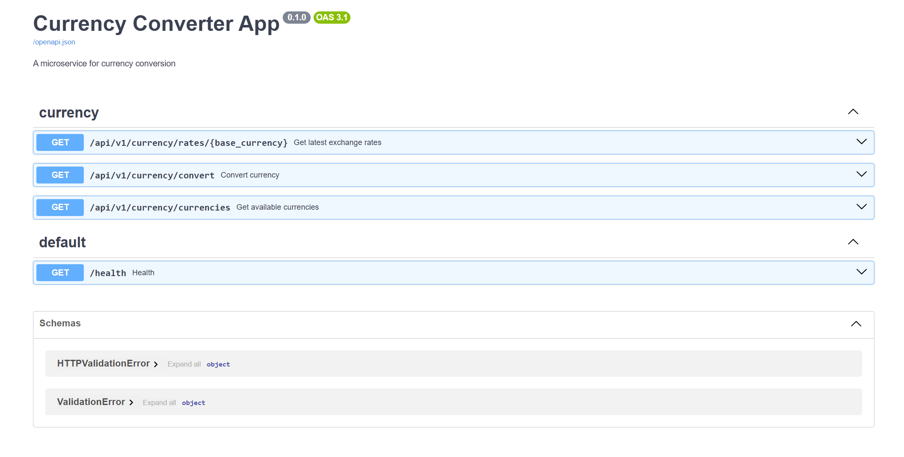
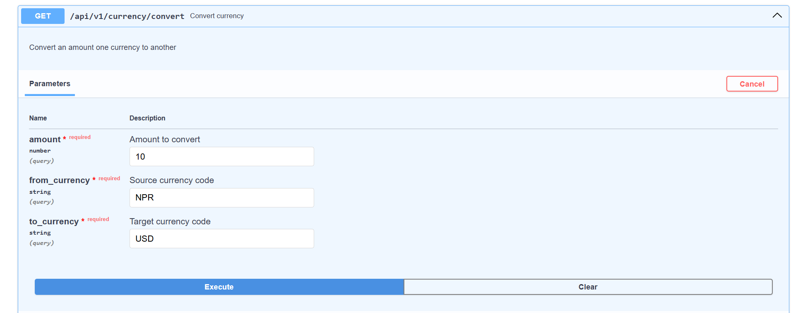
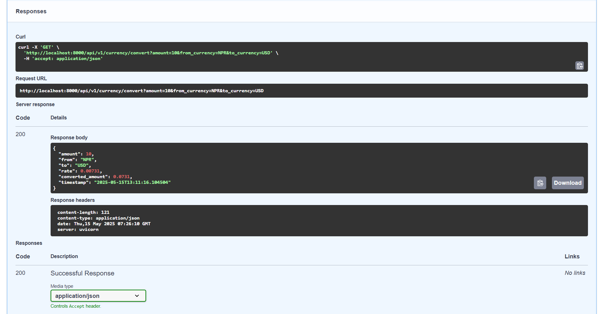

## Currency Exchange Rate App

Get the exchange rate of any currency and convert the exchange rate.

## Setup

1. **Clone the repository**

   ```bash
   git clone https://github.com/manojbaniya444/Currency-Converter
   cd Currency-Converter
   ```

2. **Set up a virtual environment**

   ```bash
   python -m venv venv
   source venv/bin/activate  # On Windows use: venv\Scripts\activate
   ```

3. **Install dependencies**

   ```bash
   pip install -r requirements.txt
   ```

4. **Start Server**

   ```bash
   fastapi dev ./app/main.py
   ```

5. **Alternatively use docker-compose to use `**Redis**` and App API easily**

   ```bash
   docker-compose up
   ```

6. **Access the documentation**

   Open [http://localhost:8000/docs](http://localhost:8000/docs) in your browser.

## Screenshots

### **Docs**



### **Request Example**



### **Response Example**


